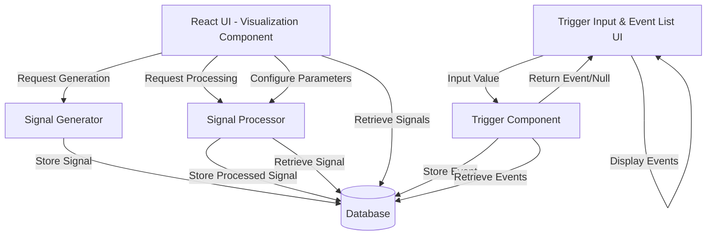

# Design Document

## Overview

The signal processing visualization application is a React-based web application that enables users to generate, process, and visualize signal waveforms in real-time. The system consists of five main components: a Signal Generator for creating synthetic signals, a Signal Processor for applying mathematical transformations, a Database for persistent storage, a Visualization Component for interactive charting, and a Trigger Component for threshold-based event detection.

The application follows a layered architecture with clear separation between the presentation layer (React UI), business logic layer (signal generation and processing), and data layer (database). This design ensures maintainability, testability, and extensibility while meeting the Windows deployment requirements.

## Architecture

### High-Level Architecture



### Technology Stack

- **Frontend**: React with TypeScript for type safety
- **Charting**: Recharts or Chart.js for signal visualization
- **Backend**: .NET 10 with ASP.NET Core Web API
- **Time-Series Database**: InfluxDB (embedded/local instance) for efficient storage and querying of high-frequency signal data
- **Metadata Database**: MongoDB (local instance) for configuration, events, and signal metadata
- **Build Tool**: Vite for frontend; .NET CLI for backend
- **Testing**: xUnit for unit tests, FsCheck for property-based testing

**Database Rationale**:
- **InfluxDB**: Optimized for time-series data with high write throughput, efficient compression, and fast range queries. Supports embedded mode for local Windows deployment without external dependencies.
- **MongoDB**: Flexible document storage for non-time-series data (signal metadata, trigger events, app configuration). Schema-less design allows easy evolution of metadata structures. Runs as a local Windows service.

### Deployment Model

The application runs as a local web server on Windows:
- Backend .NET API server binds to localhost on a configurable port (default: 5000)
- InfluxDB runs in embedded mode within the .NET process (using InfluxDB.Client library)
- MongoDB runs as a local Windows service on default port (27017)
- Frontend served as static assets from the backend or separate dev server
- Database files stored in user's application data directory
- Startup script (PowerShell/batch) ensures MongoDB service is running, launches server, and opens browser

### Onion Architecture

The application follows onion architecture principles with clear layer separation:

**Core Layer (Domain)**:
- Domain entities: `Signal`, `ProcessedSignal`, `TriggerEvent`, `AppConfig`
- Domain interfaces: `ISignalGenerator`, `ISignalProcessor`, `ITriggerComponent`
- Business logic and domain rules
- No dependencies on outer layers

**Application Layer (Use Cases)**:
- Application services: `SignalGenerationService`, `SignalProcessingService`, `TriggerService`
- DTOs for data transfer
- Orchestrates domain objects to fulfill use cases
- Depends only on Core layer

**Infrastructure Layer**:
- Database implementations (InfluxDB client, MongoDB driver)
- File system access
- External service integrations
- Implements interfaces defined in Core layer

**Presentation Layer (API + UI)**:
- ASP.NET Core Web API controllers
- React UI components
- API request/response models
- Depends on Application layer through dependency injection

**Dependency Flow**: Presentation → Application → Core ← Infrastructure

This ensures:
- Business logic is isolated and testable
- Infrastructure can be swapped without affecting core logic
- Clear separation of concerns
- Dependency inversion principle is followed

## Components and Interfaces

### 1. Signal Generator

**Responsibility**: Create synthetic signal data based on user-specified parameters.

**Interface**:
```csharp
public record SignalGeneratorParams(
    SignalType Type,
    double Frequency,      // Hz
    double Amplitude,      // Arbitrary units
    double Phase,          // Radians
    double Duration,       // Seconds
    int SampleRate         // Samples per second
);

public enum SignalType { Sine, Square, Sawtooth, Noise }

public class Signal
{
    public Guid Id { get; set; }
    public SignalType Type { get; set; }
    public double[] Samples { get; set; }      // Amplitude values
    public double[] Timestamps { get; set; }   // Time values in seconds
    public SignalGeneratorParams Metadata { get; set; }
    public DateTime CreatedAt { get; set; }
}

public interface ISignalGenerator
{
    Task<Signal> Generate(SignalGeneratorParams parameters);
    ValidationResult Validate(SignalGeneratorParams parameters);
}
```

**Key Methods**:
- `generate()`: Creates signal data using mathematical functions
- `validate()`: Checks parameter validity before generation

### 2. Signal Processor

**Responsibility**: Apply mathematical transformations to existing signals.

**Interface**:
```csharp
public record ProcessingParams(
    OperationType Operation,
    double? CutoffFrequency = null,  // Hz (for filters)
    double? LowCutoff = null,        // Hz (for bandpass)
    double? HighCutoff = null,       // Hz (for bandpass)
    double? Gain = null,             // Multiplier (for gain)
    int? Order = null                // Filter order
);

public enum OperationType { LowPass, HighPass, BandPass, Gain }

public class ProcessedSignal : Signal
{
    public Guid OriginalSignalId { get; set; }
    public ProcessingParams ProcessingParams { get; set; }
}

public interface ISignalProcessor
{
    Task<ProcessedSignal> Process(Guid signalId, ProcessingParams parameters);
    ValidationResult Validate(ProcessingParams parameters);
}
```

**Key Methods**:
- `process()`: Applies transformation to signal data
- `validate()`: Validates processing parameters

### 3. Database

**Responsibility**: Persist signal data, configurations, and events using a hybrid storage approach.

**Interfaces**:
```csharp
// Time-series data storage (InfluxDB)
public interface ITimeSeriesDatabase
{
    Task WriteSamples(Guid signalId, SignalType type, double[] samples, double[] timestamps, bool isProcessed = false);
    Task<(double[] samples, double[] timestamps)> ReadSamples(Guid signalId, DateTime? start = null, DateTime? end = null);
    Task DeleteSamples(Guid signalId);
}

// Metadata storage (MongoDB)
public interface IMetadataDatabase
{
    // Signal metadata operations
    Task SaveSignalMetadata(Guid id, SignalGeneratorParams metadata, DateTime createdAt);
    Task<SignalMetadata?> GetSignalMetadata(Guid id);
    Task<List<SignalMetadata>> GetRecentSignalMetadata(int limit);
    
    // Processed signal metadata
    Task SaveProcessedSignalMetadata(Guid id, Guid originalId, ProcessingParams parameters, DateTime createdAt);
    Task<ProcessedSignalMetadata?> GetProcessedSignalMetadata(Guid id);
    
    // Configuration operations
    Task SaveConfig(AppConfig config);
    Task<AppConfig?> LoadConfig();
    
    // Event operations
    Task SaveEvent(TriggerEvent triggerEvent);
    Task<List<TriggerEvent>> GetEvents(int limit);
    Task ClearEvents();
}

// Unified database interface (combines both)
public interface ISignalDatabase
{
    ITimeSeriesDatabase TimeSeries { get; }
    IMetadataDatabase Metadata { get; }
    
    // Convenience methods that coordinate both databases
    Task<Signal> GetCompleteSignal(Guid id);
    Task SaveCompleteSignal(Signal signal);
}
```

**InfluxDB Schema** (Time-Series Data):
- **Measurement**: `signal_samples`
  - Tags: `signal_id`, `signal_type`, `is_processed`
  - Fields: `amplitude` (double)
  - Timestamp: sample timestamp (nanosecond precision)
- **Measurement**: `processed_signal_samples`
  - Tags: `signal_id`, `original_signal_id`, `operation_type`
  - Fields: `amplitude` (double)
  - Timestamp: sample timestamp

**MongoDB Collections** (Metadata):
- **signal_metadata** collection:
  ```json
  {
    "_id": "guid",
    "type": "sine|square|sawtooth|noise",
    "frequency": 1000.0,
    "amplitude": 1.0,
    "phase": 0.0,
    "duration": 1.0,
    "sampleRate": 44100,
    "createdAt": "2025-12-04T10:00:00Z"
  }
  ```
- **processed_signal_metadata** collection:
  ```json
  {
    "_id": "guid",
    "originalSignalId": "guid",
    "operation": "lowpass|highpass|bandpass|gain",
    "cutoffFrequency": 500.0,
    "gain": 2.0,
    "order": 4,
    "createdAt": "2025-12-04T10:01:00Z"
  }
  ```
- **trigger_events** collection:
  ```json
  {
    "_id": "guid",
    "value": 5.5,
    "threshold": 5.0,
    "timestamp": "2025-12-04T10:02:00Z"
  }
  ```
- **app_config** collection:
  ```json
  {
    "_id": "config",
    "lastSignalParams": { ... },
    "lastProcessingParams": { ... },
    "triggerConfig": { ... },
    "uiPreferences": { ... }
  }
  ```

**Data Flow**:
1. Signal samples → InfluxDB (high-frequency time-series data)
2. Signal metadata → MongoDB (descriptive information)
3. Queries combine both: metadata from MongoDB, samples from InfluxDB

### 4. Visualization Component

**Responsibility**: Render interactive charts and provide UI controls.

**React Component Structure**:
```typescript
interface VisualizationProps {
  signalData: SignalData | null;
  processedData: ProcessedSignal | null;
  onGenerateSignal: (params: SignalGeneratorParams) => void;
  onProcessSignal: (params: ProcessingParams) => void;
}

// Main components
- SignalChart: Renders time-domain visualization with zoom/pan
- ParameterPanel: Input controls for signal generation
- ProcessingPanel: Controls for processing operations
- SignalSelector: Dropdown to select historical signals
```

**Key Features**:
- Dual-axis chart showing original and processed signals
- Real-time updates within 100ms of data availability
- Interactive zoom and pan using chart library features
- Form validation with immediate feedback

### 5. Trigger Component

**Responsibility**: Monitor user input and emit events when thresholds are exceeded.

**Interface**:
```csharp
public record TriggerConfig(
    double Threshold,
    bool Enabled
);

public class TriggerEvent
{
    public Guid Id { get; set; }
    public double Value { get; set; }
    public double Threshold { get; set; }
    public DateTime Timestamp { get; set; }
}

public interface ITriggerComponent
{
    void Configure(TriggerConfig config);
    Task<TriggerEvent?> CheckValue(double value);
    Task<List<TriggerEvent>> GetEvents();
}
```

**React Components**:
- `TriggerInput`: Input field for numeric values with threshold configuration
- `EventList`: Displays triggered events in reverse chronological order

## Data Models

### Signal
```csharp
public class Signal
{
    public Guid Id { get; set; }
    public SignalType Type { get; set; }
    public double[] Samples { get; set; }             // Amplitude values
    public double[] Timestamps { get; set; }          // Time values (seconds)
    public SignalGeneratorParams Metadata { get; set; }
    public DateTime CreatedAt { get; set; }
}
```

### ProcessedSignal
```csharp
public class ProcessedSignal : Signal
{
    public Guid OriginalSignalId { get; set; }       // Reference to original
    public ProcessingParams ProcessingParams { get; set; }
}
```

### TriggerEvent
```csharp
public class TriggerEvent
{
    public Guid Id { get; set; }
    public double Value { get; set; }                // Input value that triggered event
    public double Threshold { get; set; }            // Threshold at time of trigger
    public DateTime Timestamp { get; set; }          // When event occurred
}
```

### AppConfig
```csharp
public class AppConfig
{
    public Guid Id { get; set; }
    public SignalGeneratorParams? LastSignalParams { get; set; }
    public ProcessingParams? LastProcessingParams { get; set; }
    public TriggerConfig? TriggerConfig { get; set; }
    public UiPreferences? UiPreferences { get; set; }
}

public record UiPreferences(
    double ChartZoom,
    ChartPan ChartPan
);

public record ChartPan(double X, double Y);
```


## Correctness Properties

*A property is a characteristic or behavior that should hold true across all valid executions of a system—essentially, a formal statement about what the system should do. Properties serve as the bridge between human-readable specifications and machine-verifiable correctness guarantees.*

### Property Reflection

After analyzing all acceptance criteria, I've identified the following redundancies to eliminate:

- **Properties 1.1 and 1.5** both test signal generation with parameters - these can be combined into a single comprehensive property that verifies both creation and parameter accuracy
- **Properties 2.1 and 2.3** both involve processing signals - 2.3 (storage) is a consequence of 2.1 (processing), so we can combine them
- **Properties 6.1 and 6.2** both test data persistence - 6.2 is more specific about what metadata to store, so 6.1 is redundant

After consolidation, here are the unique correctness properties:

### Signal Generation Properties

**Property 1: Signal generation with parameters**
*For any* valid signal type and generation parameters (frequency, amplitude, phase, duration), generating a signal should produce Signal Data with samples and timestamps that reflect the specified parameters, and the signal should be stored in the Database with all metadata intact.
**Validates: Requirements 1.1, 1.3, 1.5**

**Property 2: Invalid parameter rejection**
*For any* invalid generation parameters (negative frequency, zero duration, out-of-range values), the Signal Generator should reject the request and return an error message without creating signal data.
**Validates: Requirements 1.4**

### Signal Processing Properties

**Property 3: Signal processing preserves original**
*For any* signal and valid processing parameters, applying processing should create a new processed signal while leaving the original signal data completely unchanged in the Database.
**Validates: Requirements 2.1, 2.3, 2.4**

**Property 4: Invalid processing parameter rejection**
*For any* invalid processing parameters (negative cutoff frequency, invalid operation type), the Signal Processor should reject the operation, maintain the current state, and not create any processed signal data.
**Validates: Requirements 2.5**

### Visualization Properties

**Property 5: Chart renders signal data**
*For any* valid Signal Data, the Visualization Component should render a chart containing all sample points with time on the x-axis and amplitude on the y-axis.
**Validates: Requirements 3.1**

**Property 6: Parameter validation feedback**
*For any* parameter input (valid or invalid), the Visualization Component should validate the input and provide immediate feedback indicating whether the value is acceptable.
**Validates: Requirements 4.2**

**Property 7: Parameter application triggers processing**
*For any* valid processing parameters applied through the UI, the Visualization Component should invoke the Signal Processor with exactly those parameters.
**Validates: Requirements 4.3**

**Property 8: Invalid parameter prevention**
*For any* invalid parameter value, the Visualization Component should display an error message and prevent the invalid value from being applied to the Signal Processor.
**Validates: Requirements 4.5**

### Trigger Properties

**Property 9: Threshold comparison**
*For any* numeric input value and configured threshold, the Trigger Component should correctly determine whether the value exceeds the threshold.
**Validates: Requirements 5.1**

**Property 10: Event emission on threshold exceeded**
*For any* input value that exceeds the configured threshold, the Trigger Component should emit an event containing the input value and a timestamp.
**Validates: Requirements 5.2**

**Property 11: Event display**
*For any* emitted event, the Event List should display the event with its value and timestamp.
**Validates: Requirements 5.3**

**Property 12: Event ordering**
*For any* sequence of triggered events, the Event List should display them in reverse chronological order with the most recent event at the top.
**Validates: Requirements 5.5**

### Database Properties

**Property 13: Signal persistence with metadata**
*For any* generated or processed signal, storing it in the Database should preserve all signal data (samples, timestamps) and metadata (generation/processing parameters, timestamps), and retrieving it should return equivalent data.
**Validates: Requirements 6.1, 6.2**

**Property 14: Query retrieval**
*For any* set of stored signals and query criteria, the Database should retrieve only signals that match the specified criteria.
**Validates: Requirements 6.3**

**Property 15: Referential integrity**
*For any* processed signal stored in the Database, the reference to its original signal should remain valid, and retrieving the original signal ID should return the correct original signal.
**Validates: Requirements 6.4**

## Error Handling

### Validation Errors

**Signal Generation**:
- Frequency ≤ 0 → "Frequency must be positive"
- Amplitude ≤ 0 → "Amplitude must be positive"
- Duration ≤ 0 → "Duration must be positive"
- Phase outside [-2π, 2π] → "Phase must be between -2π and 2π"
- Sample rate < 2 × frequency → "Sample rate must satisfy Nyquist criterion"

**Signal Processing**:
- Cutoff frequency ≤ 0 → "Cutoff frequency must be positive"
- Cutoff frequency ≥ Nyquist frequency → "Cutoff frequency must be below Nyquist frequency"
- Gain ≤ 0 → "Gain must be positive"
- Invalid operation type → "Unsupported operation type"
- Signal not found → "Signal ID does not exist"

**Trigger Component**:
- Non-numeric input → "Input must be a valid number"
- Threshold not configured → "Threshold must be set before checking values"

### System Errors

**Database Errors**:
- Connection failure → Retry with exponential backoff (3 attempts)
- Write failure → Log error and notify user
- Read failure → Return cached data if available, otherwise error

**UI Errors**:
- Chart rendering failure → Display error message, allow retry
- Network timeout → Show loading state, retry after 5 seconds

### Error Recovery

- All errors should be logged with timestamps and context
- User-facing errors should provide actionable guidance
- System should remain in consistent state after any error
- Database transactions should be atomic (rollback on failure)

## Testing Strategy

### Unit Testing

Unit tests will verify specific examples and integration points:

**Signal Generator**:
- Test each signal type generates correct waveform shape
- Test boundary conditions (very small/large parameters)
- Test error messages for invalid inputs

**Signal Processor**:
- Test each filter type produces expected frequency response
- Test gain adjustment multiplies correctly
- Test error handling for missing signals

**Database**:
- Test CRUD operations for each entity type
- Test query filtering logic
- Test transaction rollback on errors

**Trigger Component**:
- Test threshold comparison edge cases (exactly at threshold)
- Test event emission with correct data
- Test configuration updates

**Visualization Component**:
- Test chart renders with empty data
- Test parameter form validation
- Test event list updates

### Property-Based Testing

Property-based tests will verify universal properties across all inputs using **fast-check** library:

**Configuration**:
- Each property test will run a minimum of 100 iterations
- Tests will use custom generators for domain-specific types
- Each test will be tagged with the format: `**Feature: signal-processing-viz, Property {number}: {property_text}**`

**Test Organization**:
- Each correctness property will be implemented as a single property-based test
- Tests will be placed close to implementation to catch errors early
- Property tests will be written after core implementation is complete

**Generators** (using FsCheck):
- `SignalGeneratorParams`: Generate valid combinations of signal parameters
- `ProcessingParams`: Generate valid processing configurations
- `Signal`: Generate realistic signal data with various characteristics
- `InvalidParams`: Generate various types of invalid inputs for error testing

**Example Property Test Structure**:
```csharp
// Feature: signal-processing-viz, Property 1: Signal generation with parameters
[Fact]
public void GeneratedSignalsReflectInputParameters()
{
    Prop.ForAll(
        ValidSignalParamsGenerator(),
        async params =>
        {
            var signal = await _signalGenerator.Generate(params);
            var retrieved = await _database.GetSignal(signal.Id);
            
            Assert.NotNull(retrieved);
            Assert.Equal(params.Frequency, retrieved.Metadata.Frequency);
            Assert.Equal(params.Amplitude, retrieved.Metadata.Amplitude);
            // ... verify other parameters
            return true;
        }
    ).QuickCheckThrowOnFailure();
}
```

### Integration Testing

Integration tests will verify end-to-end workflows:
- Generate signal → Process signal → Visualize both
- Configure trigger → Input values → View events
- Save configuration → Restart app → Load configuration

### Test Execution

- Unit tests run on every file save
- Property tests run before commits
- Integration tests run in CI/CD pipeline
- All tests must pass before merging

## Performance Considerations

### Signal Generation
- Pre-calculate waveform lookup tables for common frequencies
- Use typed arrays (Float64Array) for efficient memory usage
- Generate signals in Web Workers for large datasets

### Signal Processing
- Implement filters using efficient algorithms (Butterworth, Chebyshev)
- Use FFT for frequency-domain operations
- Cache processed results to avoid recomputation

### Visualization
- Downsample signals for display when sample count > 10,000
- Use canvas-based rendering for better performance
- Implement virtual scrolling for event list
- Debounce chart updates to 100ms intervals

### Database
- **InfluxDB**: Automatic time-based indexing, batch writes (1000+ points per batch), use downsampling for visualization
- **MongoDB**: Index signal IDs and timestamps, use connection pooling, leverage document model for flexible metadata
- Write samples to InfluxDB in batches to minimize I/O overhead
- Query InfluxDB with time ranges to retrieve only visible data points
- Use InfluxDB's built-in compression (typically 10:1 ratio for signal data)
- MongoDB indexes: `signal_metadata._id`, `signal_metadata.createdAt`, `trigger_events.timestamp`

## Security Considerations

### Input Validation
- Sanitize all user inputs before processing
- Enforce parameter ranges to prevent resource exhaustion
- Validate file paths to prevent directory traversal

### Data Storage
- Store database file in user-specific directory
- Set appropriate file permissions (user read/write only)
- No sensitive data stored (signals are synthetic)

### Network
- Bind server to localhost only (no external access)
- Use CORS headers to restrict API access
- No authentication required (local-only application)

## Deployment

### Windows Startup Script

**PowerShell script** (`start.ps1`):
```powershell
# Check .NET installation
if (-not (Get-Command dotnet -ErrorAction SilentlyContinue)) {
    Write-Error ".NET 10 SDK is not installed"
    exit 1
}

# Check MongoDB service
$mongoService = Get-Service -Name "MongoDB" -ErrorAction SilentlyContinue
if ($null -eq $mongoService) {
    Write-Error "MongoDB service is not installed. Please install MongoDB Community Edition."
    exit 1
}

# Start MongoDB service if not running
if ($mongoService.Status -ne "Running") {
    Write-Host "Starting MongoDB service..."
    Start-Service -Name "MongoDB"
    Start-Sleep -Seconds 2
}

# Start backend server
$serverProcess = Start-Process -FilePath "dotnet" -ArgumentList "run --project src/SignalProcessing.Api/SignalProcessing.Api.csproj" -PassThru -NoNewWindow

# Wait for server to be ready
Start-Sleep -Seconds 3

# Open browser
Start-Process "http://localhost:5000"

# Wait for user to close
Write-Host "Press Ctrl+C to stop the server"
Wait-Process -Id $serverProcess.Id
```

**Batch script** (`start.bat`):
```batch
@echo off
dotnet --version >nul 2>&1
if errorlevel 1 (
    echo .NET 10 SDK is not installed
    exit /b 1
)

REM Check MongoDB service
sc query MongoDB >nul 2>&1
if errorlevel 1 (
    echo MongoDB service is not installed. Please install MongoDB Community Edition.
    exit /b 1
)

REM Start MongoDB service if not running
sc query MongoDB | find "RUNNING" >nul
if errorlevel 1 (
    echo Starting MongoDB service...
    net start MongoDB
    timeout /t 2 /nobreak >nul
)

start /B dotnet run --project src\SignalProcessing.Api\SignalProcessing.Api.csproj
timeout /t 3 /nobreak >nul
start http://localhost:5000

echo Press Ctrl+C to stop the server
pause
```

### Directory Structure
```
signal-processing-viz/
├── src/
│   ├── SignalProcessing.Core/              # Core/Domain Layer
│   │   ├── Entities/
│   │   │   ├── Signal.cs
│   │   │   ├── ProcessedSignal.cs
│   │   │   ├── TriggerEvent.cs
│   │   │   └── AppConfig.cs
│   │   ├── Interfaces/
│   │   │   ├── ISignalGenerator.cs
│   │   │   ├── ISignalProcessor.cs
│   │   │   ├── ITriggerComponent.cs
│   │   │   └── IDatabase.cs
│   │   └── ValueObjects/
│   │       ├── SignalGeneratorParams.cs
│   │       └── ProcessingParams.cs
│   ├── SignalProcessing.Application/       # Application Layer
│   │   ├── Services/
│   │   │   ├── SignalGenerationService.cs
│   │   │   ├── SignalProcessingService.cs
│   │   │   └── TriggerService.cs
│   │   ├── DTOs/
│   │   │   ├── SignalDto.cs
│   │   │   ├── ProcessingRequestDto.cs
│   │   │   └── TriggerEventDto.cs
│   │   └── Interfaces/
│   │       └── ISignalApplicationService.cs
│   ├── SignalProcessing.Infrastructure/    # Infrastructure Layer
│   │   ├── Data/
│   │   │   ├── MongoDbContext.cs
│   │   │   ├── InfluxDbContext.cs
│   │   │   └── Repositories/
│   │   ├── SignalGenerator.cs
│   │   ├── SignalProcessor.cs
│   │   └── TriggerComponent.cs
│   ├── SignalProcessing.Api/               # Presentation Layer
│   │   ├── Controllers/
│   │   │   ├── SignalsController.cs
│   │   │   ├── ProcessingController.cs
│   │   │   └── TriggersController.cs
│   │   ├── Program.cs
│   │   ├── appsettings.json
│   │   └── wwwroot/                        # Static frontend files
│   └── SignalProcessing.Tests/
│       ├── Unit/
│       ├── Property/                       # FsCheck property tests
│       └── Integration/
├── client/                                  # React Frontend
│   ├── src/
│   │   ├── components/
│   │   │   ├── SignalChart.tsx
│   │   │   ├── ParameterPanel.tsx
│   │   │   ├── ProcessingPanel.tsx
│   │   │   ├── TriggerInput.tsx
│   │   │   └── EventList.tsx
│   │   ├── services/
│   │   │   └── api.ts
│   │   └── App.tsx
│   ├── package.json
│   └── vite.config.ts
├── data/
│   ├── mongodb/                            # MongoDB data directory
│   └── influxdb/                           # InfluxDB data directory
├── start.ps1
├── start.bat
└── SignalProcessing.sln
```

## Future Enhancements

- Frequency-domain visualization (FFT spectrum)
- Export signals to CSV/JSON
- Import signals from files
- Additional filter types (notch, all-pass)
- Real-time signal streaming from audio input
- Multi-signal comparison view
- Signal arithmetic operations (add, subtract, multiply)
